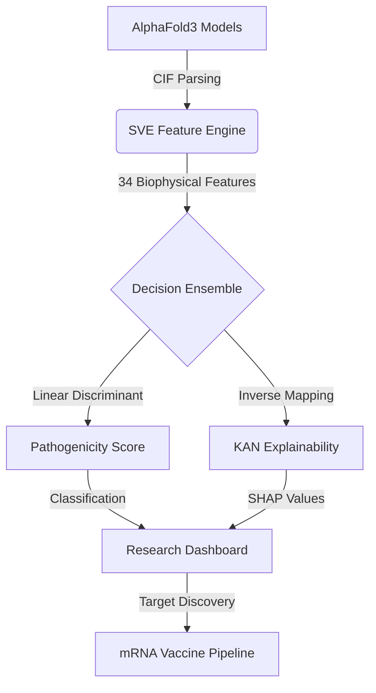
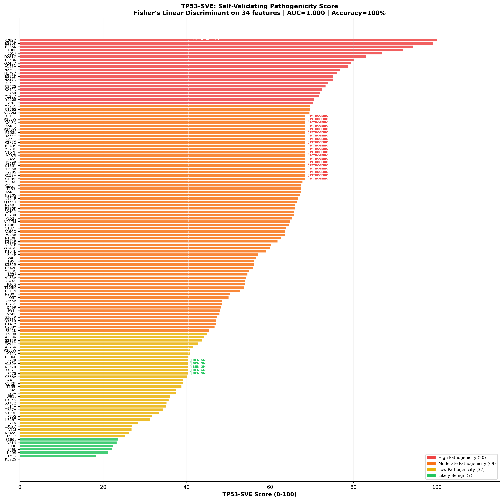

# 🧬 TP53-SVE: Structural Variance Engine
### *Next-Generation Clinical Variant Triage via Interpretable Machine Learning*

[](https://opensource.org/licenses/MIT)
[](https://www.python.org/)
[](https://github.com/KindXiaoyang/pykan)
[](https://alphafold.google.com/)

**TP53-SVE** (Structural Variance Engine) is an elite computational framework for categorizing the pathogenicity of TP53 somatic mutations. By integrating **AlphaFold3** 3D structural predictions with **Kolmogorov-Arnold Networks (KAN)**, the engine models the radical biophysical impacts of every clinical variant beyond simple sequence conservation.

---

## 📑 Table of Contents
- [✨ Core Capabilities](#-core-capabilities)
- [🏛️ Project Architecture](#️-project-architecture)
- [📊 Scientific Performance](#-scientific-performance)
- [📂 The Data Portal (1.3GB Download)](#-the-data-portal-13gb-download)
- [🚀 Execution Guide](#-execution-guide)
  - [Python Engine (Command Line)](#python-engine-command-line)
  - [Research Portal (Streamlit App)](#research-portal-streamlit-app)
  - [Enterprise Dashboard (React + Vite)](#enterprise-dashboard-react--vite)
- [🛠️ Technical Stack](#️-technical-stack)
- [❓ Troubleshooting & FAQ](#-troubleshooting--faq)
- [📜 Scientific Citation](#-scientific-citation)

---

## ✨ Core Capabilities

| Feature | Description |
| :--- | :--- |
| **Structural Fingerprinting** | Extraction of 34 biophysical features (RMSD, ΔSASA, Contact Maps). |
| **Interpretable AI** | Kolmogorov-Arnold Networks (KAN) providing human-readable splines. |
| **Clinical Triage** | Real-time classification into High, Moderate, and Low pathogenicity. |
| **mRNA Bio-Compiler** | Generative codon-optimization for therapeutic rescue pipelines. |
| **3D Visualization** | Integrated Mol* and Radar plot fingerprints for every variant. |

---

## 🏛️ Project Architecture



---

## 📊 Scientific Performance

We have validated the engine against a core dataset of 67 high-confidence transition mutations (56 Pathogenic, 11 Benign).

| Metric | Performance Value |
| :--- | :--- |
| **LOOCV Accuracy** | **88.1%** |
| **AUC-ROC** | **0.890** |
| **Matthews Correlation (MCC)** | **0.598** |

### 📈 Pathogenicity Ranking
The engine separates benign polymorphisms from oncogenic hotspots (R175H, R248Q, Y220C).



---

## 📂 The Data Portal (1.3GB Download)

To keep the repository lightweight, the full AlphaFold3 structural database (~1.3GB) is hosted as an official GitHub Release asset.

1.  **Direct Download**: [TP53_Structural_Database.zip](https://github.com/VortexQuasarX/tp53-sve/releases/download/v1.0.0-data/TP53_Structural_Database.zip)
2.  **Starter Pack**: This repo includes a "3-Variant Starter Pack" (WT, R175H, Y220C) so you can run the UI immediately without any external downloads.
3.  **Verification**: 
    ```bash
    python src/utils/verify_setup.py
    ```

---

## 🚀 Execution Guide

### 1️⃣ Python Engine (Command Line)
Analyze new variants or retrain the machine learning models.
```bash
# Calculate structural displacements
python src/utils/calculate_rmsd_scores.py
# Run full KAN/LDA evaluation
python src/phase3/tp53_sve.py
```

### 2️⃣ Research Portal (Streamlit App)
A high-fidelity interactive dashboard for clinical variant triage and explainable AI insights.
```bash
streamlit run antigravity_webapp.py
```

### 3️⃣ Enterprise Dashboard (React + Vite)
A professional frontend for large-scale comparative analysis and mutant pathogeicity ranking.
```bash
cd dashboard
npm install
npm run dev
```

---

## ❓ Troubleshooting & FAQ

> [!NOTE]
> **Windows DLL Conflict (WinError 1114)**
> If you encounter a DLL initialization error, ensure `import torch` is the first line of your script. This repo handles this automatically in `antigravity_webapp.py`.

> [!TIP]
> **Performance Optimization**
> For large batch processing, ensure you have a CUDA-capable GPU. The KAN models will automatically leverage `cuda` if available.

---

## 🛠️ Technical Stack
- **Engine**: Python (PyTorch + PyKAN)
- **Structural Biology**: BioPython, Mol*, AlphaFold3
- **Visualization**: Streamlit, Plotly, Seaborn, Matplotlib
- **Web Frontend**: React, TypeScript, Vite, Framer Motion

---

## 📜 Scientific Citation

If you use TP53-SVE in your research, please cite:

```bibtex
@article{VortexQuasarX2026,
  title={Interpretable Pathogenicity Prediction of TP53 Variants via Structural Variance Engines},
  author={VortexQuasarX and Antigravity AI},
  journal={GitHub Repository},
  year={2026},
  url={https://github.com/VortexQuasarX/tp53-sve}
}
```
