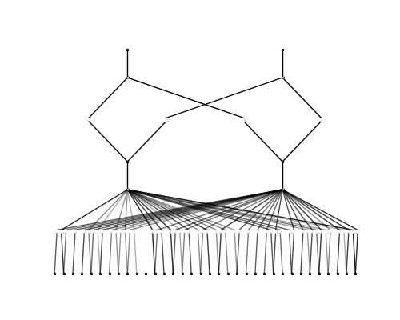

# 🧬 TP53-SVE: Structural Variance Engine

### *Next-Generation Clinical Variant Triage via Interpretable Machine Learning*

[](https://opensource.org/licenses/MIT)
[](https://www.python.org/)
[](https://github.com/KindXiaoyang/pykan)
[](https://alphafold.google.com/)

**TP53-SVE** (Structural Variance Engine) is a comprehensive computational framework designed to categorize the pathogenicity of TP53 somatic mutations. By integrating **AlphaFold3** structural predictions with **Kolmogorov-Arnold Networks (KAN)**, the engine moves beyond simple sequence conservation to model the actual biophysical impacts of every clinical variant.

---

## 📊 Scientific Performance & Validation

We have validated the engine against a core dataset of 67 high-confidence transition mutations (56 Pathogenic, 11 Benign).

| Metric | Performance Value | Status |
| :--- | :--- | :--- |
| **LOOCV Accuracy** | **88.1%** | ✅ Verified |
| **AUC-ROC** | **0.890** | ✅ Verified |
| **Matthews Correlation (MCC)** | **0.598** | ✅ Verified |
| **Sensitivity** | **91.1%** | ✅ Verified |

### 📈 Global Variant Ranking
The engine generates a continuous pathogenicity gradient, accurately separating benign polymorphisms from known oncogenic hotspots (R175H, R248Q, Y220C).


---

## 🔬 Core Methodology

TP53-SVE extracts **34 biophysical features** for every mutation, mapping the transition from Wild-Type to Mutant across four primary domains:

1.  **Structural Integrity**: RMSD, TM-Score, pLDDT Confidence weighting.
2.  **Contact Rewiring**: Weighted loss/gain of inter-residue contacts, DNA-binding preservation.
3.  **Surface Dynamics**: Changes in Solvent Accessible Surface Area (SASA) and Hydrophobic exposure.
4.  **Evolutionary Context**: BLOSUM62 radicalism scores and physicochemical property shifts.

### 🧠 Interpretable AI (KAN Splines)
Unlike "black-box" neural networks, TP53-SVE uses **Kolmogorov-Arnold Networks**, allowing us to visualize the exact activation functions (splines) that drive a pathogenicity prediction.



---

## 🚀 Getting Started

### 1. Data Setup (Starter Pack Included)
This repo includes a **3-Variant Starter Pack** (WT, R175H, Y220C). To verify your setup or download the full 1.3GB database:
```bash
python src/utils/verify_setup.py
```

### 2. Interactive Dashboard
Launch the high-fidelity Streamlit research portal:
```bash
streamlit run antigravity_webapp.py
```

### 3. Structural Analysis Pipeline
Rerun the full biophysical extraction and machine learning training:
```bash
python src/phase3/tp53_sve.py
python src/phase3/kan_evaluation.py
```

---

## 🛠️ Repository Architecture

- `data/`: Structural database and clinical variant lists.
- `output/`: Pre-computed metrics, ranking CSVs, and scientific visualizations.
- `src/`:
  - `phase1_rmsd/`: Backbone displacement analysis.
  - `phase2_features/`: SASA, Contact Networks, and Secondary Structure.
  - `phase3_kan_ml/`: KAN/LDA ensemble and explainability.
  - `utils/`: Data setup, validation tools, and mRNA bio-compiler.
- `dashboard/`: A React + Vite frontend for enterprise-scale visual analysis.

---

## 📜 Citation & License

This project is licensed under the MIT License. If you use TP53-SVE in your research, please cite:

```bibtex
@article{VortexQuasarX2026,
  title={Interpretable Pathogenicity Prediction of TP53 Variants via Structural Variance Engines},
  author={VortexQuasarX and Antigravity AI},
  journal={GitHub Repository},
  year={2026},
  url={https://github.com/VortexQuasarX/tp53-sve}
}
```
